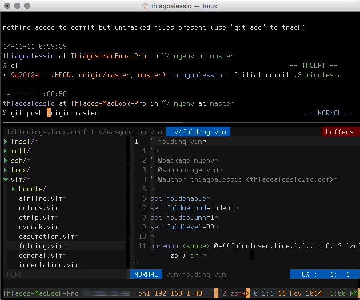

# myenv

My world famous, most desired dotfiles collection ;D

## Dependencies

* [git](http://git-scm.com/)
* [zsh](http://www.zsh.org/)
* [tmux](http://tmux.sourceforge.net)
* [vim](http://www.vim.org/)
* [ctags](http://ctags.sourceforge.net/)

### OS X

    $ brew install git zsh tmux vim ctags-exuberant

### Arch Linux

    # pacman -S install git zsh tmux vim ctags

### Debian/Ubuntu

    # apt-get install git zsh tmux vim exuberant-ctags

## Installation

    $ git clone --recursive https://github.com/thiagoalessio/myenv.git ~/.myenv
    $ sh ~/.myenv/install.sh

### Fonts, colors and mappings

+ [Terminus](http://terminus-font.sourceforge.net)
  - [TTF](http://files.ax86.net/terminus-ttf/)
+ [jellybeans](https://github.com/nanotech/jellybeans.vim)
  - [OSX Terminal](https://gist.github.com/nickfletcher/8360231)
  - [iTerm 2](https://github.com/qtpi/Jellybeans.itermcolors)
  - [xterm](http://invisible-island.net/xterm/)
+ Mappings for [Dvorak](http://en.wikipedia.org/wiki/Dvorak_Simplified_Keyboard).

## Screenshot

